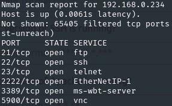

Ansible managed homelab
==================
  
Playbooks, inventories and config files used with Ansible to manage my small homelab.
This is still ongoing project and currently I'm waiting for more equipment to expand my network.
For now I've used Cisco switch and routers to segment my network. I also created my own UTP patchcords and crimped RJ45 connectors according to T568B standard.
Currently all services are running on multiple Raspberry Pi devices:
  - Honeypot
  - Web server
  - Network-Attached Storage
  - CTF lab
  - Tor proxy router
  - Pi-hole
    
More about them:
 

------------

- Honeypot (RPi 3B)		- Ubuntu server connected to Internet to catch common and automated scans or indicators of compromise. Runs listener that spoof signatures and keeps open ports for FTP, SSH, Telnet, VNC, RDP protocols. Configured PSAD and Snort in IDS mode, logs any attacks attempts, while Splunk forwarder sends logs to indexer hosted on my PC. On average, honeypot detects approximately 20000 malicious activities per day with SSH password spraying attacks on the lead. Most attacks come from China, United Kingdom and India.

 

------------

- Web server (RPi Zero 2) 		- Nginx server hosting my website, open to public. Firewalld, Snort and Splunk configured for security, log aggregation and traffic analizing. SSL certificates installed, authentication and content caching configured.

------------

- NAS (RPi 3B) 		- Hosting ownCloud as private network-attached storage server, accessible within my local network. Due to attached weak HDD, currently it only acts as private repo for all of my projects. 

------------

- CTF lab (RPi 4B)    - Kali Linux machine for solving CTF challenges, configured for remote access via RDP or VNC. Firewalld, Snort and Splunk have been configured for additional security.

------------

- Tor router (RPi 3B)    - Proxy router for evading pervasive surveillance and hidding my activities inside tor network that utilizes onion routing. Using Nyx for monitoring Tor network status and traffic.

------------

- Pi-hole (RPi Zero)    - Private DNS server that blocks internet advertisements and tracking domains.

